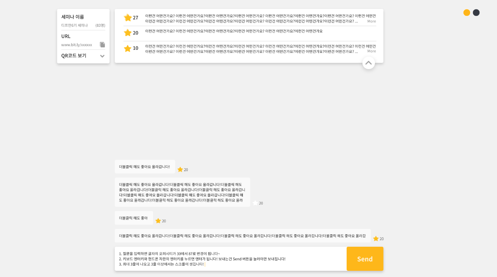

# Question Ranking | 질문 랭킹
> Q & A Polling Web Application (in vanilla JavaScript)

> 실시간 질문 설문 웹 서비스

| / | /{roomId} |
|:-------------------------:|:-------------------------:|
|  |  |
| user can create a new channel | users can post and vote up questions |

## Real-time Q & A Polling Service
- For Depromeet 6th mini-project
- Created a real-time Q & A polling service similar to Sli.do
- Used Vanilla JavaScript

## 실시간 질문 설문 서비스
- 디프만 6기 미니 프로젝트

